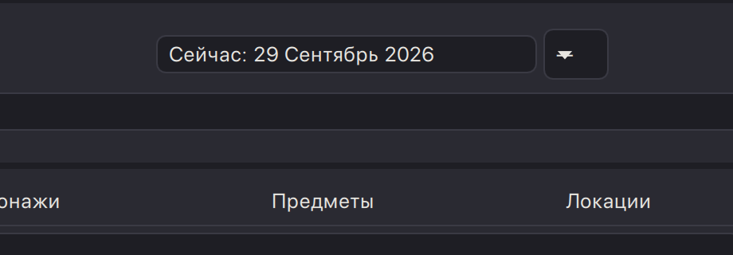
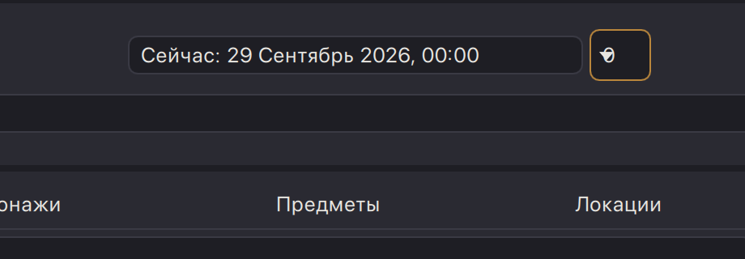
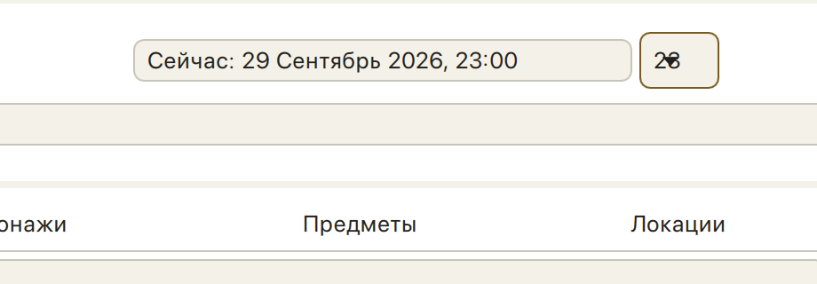
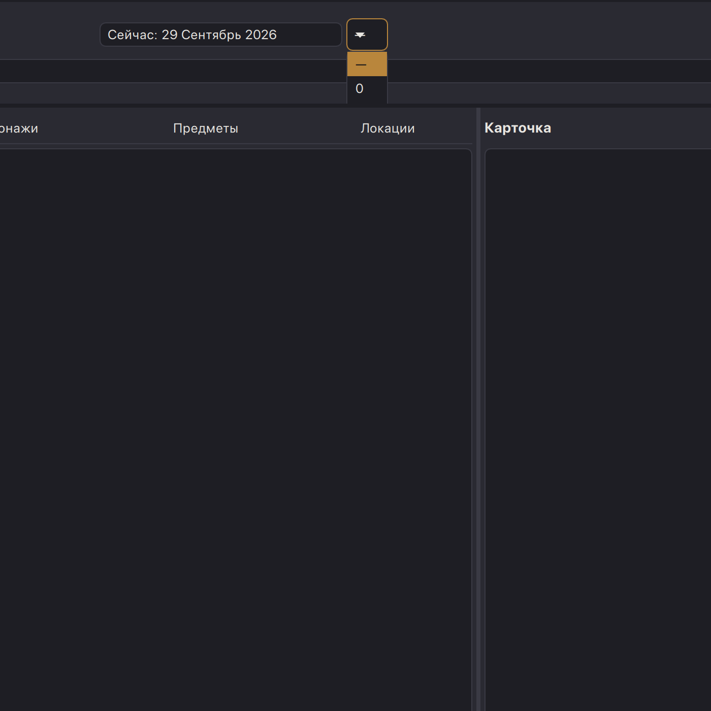
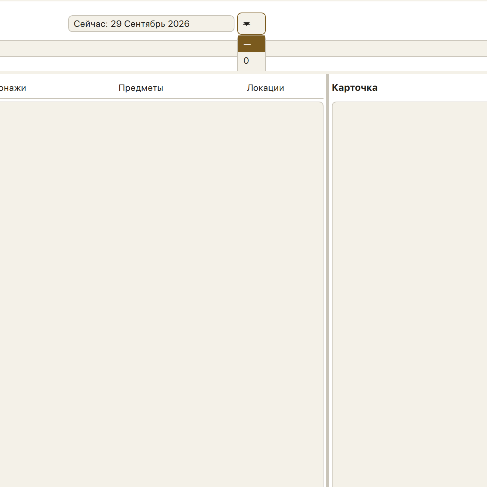

# Живой дизайн-аудит: чип «Сейчас: <дата>» и соседний список часов (NRI-0023)

- Дата: 2026-09-29
- Точка проверки: шапка главного окна — виджет «Виджет „Сейчас: <дата>“» и его сосед
  `ThemeComboBox` часов (`objectName: nowHourCombo`, имя в дереве «Час сейчас») плюс
  `NowDateViewModel`. Заявленные проблемы: **H1** — непонятно, что контрол выбирает часы;
  **H2** — «смотрится очень криво» (геометрия контрола относительно чипа, раскрытый попап).
  Плюс сбор смежных дефектов этого же узла.
- Вердикт: **inspected live** — интерфейс осмотрен на реальном Retina-рендере (2 px/pt),
  обе темы. **H1 подтверждена, H2 подтверждена**; найдено 9 смежных дефектов узла (A1…A9),
  из них один blocker-уровня: в списке часов физически недоступны все значения, кроме «—»
  и «0».
- Сборка/среда: рабочее дерево `master_workspace` (код не менялся), macOS, экран
  2560×1440 pt @2x, `python dev_run.py` (пакет «Master Workspace Dev», pid 52483),
  throwaway-игра `qa-2026-09-29` (создана сегодня этим же QA-контуром, стандартный
  календарь 24 часа). Затронутые компоненты (только чтение):
  `app/presentation/qml/SearchBarRoot.qml` (`nowDateRow`),
  `app/presentation/qml/nri/components/ThemeComboBox.qml`,
  `app/presentation/qml/nri/components/ThemeDateField.qml`,
  `app/presentation/viewmodels/now_date_view_model.py`.
- QA-ограничения соблюдены: игры пользователя не открывались и не удалялись; кнопки
  AI-генерации (✨) не нажимались; тема возвращена в тёмную; `~/.nri_manager/ui.json`
  возвращён к исходному содержимому; приложение остановлено `pkill -if "app.main"`.
- Методика: `get_app_state`/AXPress по element id (чтение подписи чипа, имя контрола);
  реальные мышиные и клавиатурные события `CGEventPost` (`cgclick.py`, `cgscroll.py` во
  временной папке — паттерн OBS-1 из `docs/qa/2026-09-26-timeline-row-radius.md`), потому
  что фоновые координатные клики computer-use до QML-островов не доходят (подтверждено и
  в этом прогоне); `screencapture -x -R` + попиксельный разбор Pillow (соединённые
  компоненты, профили границ, ASCII-рендер глифов); темы переключались нативным меню
  «Настройки → Светлая тема».

Координаты в отчёте — экранные пункты (pt); снимки — Retina 2 px/pt. Область замера —
окно 2560×1374 pt, позиция (0, 30); узел живёт в верхней полосе острова поиска.

---

## H1. Контрол не объясняет, что он выбирает ЧАСЫ — ПОДТВЕРЖДЕНО

### Что видно

Замер нулевого состояния (час не выставлен, тёмная тема, не в фокусе):

- у контрола **нет ни одной подписи**: ни префикса («Час:»), ни надписи над/под ним, ни
  подсказки — `ThemeComboBox` в `SearchBarRoot.qml` несёт только `Accessible.name:
  "Час сейчас"` (он есть в дереве, но на экране его нет) и `model` из строк-цифр;
- видимое содержимое контрола — **один глиф** («—» или «0») плюс треугольник стрелки,
  нарисованный **поверх** этого глифа (замер ниже, раздел «Смежные» A4). Вот что заказчица
  приняла за «иконку часов»: слитный значок в квадрате 41×32 pt;
- связь с чипом даты держится только на соседстве: рамка чипа кончается на x 1376.5,
  рамка контрола начинается на x 1381.0 — **зазор 4.5 pt** (`space.xs`), при этом контрол
  на 8 pt выше чипа и потому читается как отдельный чужой пункт, а не как «хвост» чипа
  (геометрия — в H2);
- весь узел висит **посередине верхней полосы острова поиска**, над полем ввода
  («Поиск по всем сущностям…», y 118–141.5), ни с чем визуально не связанный: до поля
  поиска от чипа 12.5 pt, от контрола часов — 8.5 pt. Первый читатель не может
  предположить, что это про часы «сейчас», а не про поиск/фильтр.

В закрытом состоянии с выставленным часом картина та же, только глиф другой:

### Почему мешает

Назначение контрола угадывается только из подписи чипа слева, а в подписи про часы ни
слова до момента выбора: пока час не выбран, чип говорит «Сейчас: 29 Сентябрь 2026» —
неоткуда понять, что соседний квадрат про «час». Хуже: выбор часа **и есть единственный
способ понять назначение** — то есть обучение через действие, причём списком, в котором
(см. смежный A1) видно лишь два значения из двадцати пяти.

### Proposed look

- **A (минимальная правка, рекомендую как базовую.)** Инлайн-селект с подписью внутри
  рамки, той же высоты, что чип: содержимое всегда `«Час: —» / «Час: 0» … «Час: 23»`
  (префикс — часть `displayText`, список остаётся цифрами). Ширина — по самому широкому
  варианту («Час: 23»), фиксированная: пропадает и дёрганье из H2, и наложение стрелки.
- **B (чище визуально.)** Слить час в сам чип: чип становится `Сейчас: 29 Сентябрь 2026`
  + отделённый хвост `, —` / `, 07:00`; клик по хвосту открывает тот же список, стрелка
  disclosure — у хвоста внутри той же рамки. Один контрол, одна baseline, связь с датой
  очевидна, второй коробки в шапке нет вовсе.
- **C (если коробки принципиально две.)** Подпись «Час» слева от контрола тем же
  `font.size.md`/`fg.muted`, контрол приведён к высоте чипа; это лучше текущих двух
  квадратиков, но всё равно два независимых бокса вместо одного значения.
- В любом варианте значение «час не выставлен» стоит печатать `color.fg.muted`, а реальный
  час — `color.fg.primary`: тогда «—» и «0» различаются не формой глифа, а рангом.

---

## H2. Геометрия узла кривая — ПОДТВЕРЖДЕНО (кроме предположения о baseline)

### 1. Высота и выравнивание контрола относительно чипа

Попиксельно (соединённые компоненты по отличию от `color.bg.surface`), значения pt:

| состояние | чип `nowDateField` | контрол `nowHourCombo` | Δ высоты | вылезает |
|---|---|---|---|---|
| час не выставлен («—») | x 1138.0–1376.5, y 82.0–105.5 → **239.0 × 24.0** | x 1381.0–1421.5, y 78.0–109.5 → **41.0 × 32.0** | **+8.0 (+33 %)** | 4.0 pt над верхом чипа и 4.0 pt под его низом |
| час 0 | x 1119.0–1399.5 → 281.0 × 24.0 | x 1404.0–1441.5 → **38.0** × 32.0 | +8.0 | те же 4 + 4 |
| час 1 | x 1120.0–1400.5 → 281.0 × 24.0 | x 1405.0–1439.5 → **35.0** × 32.0 | +8.0 | те же 4 + 4 |
| час 23 | x 1115.0–1395.5 → 281.0 × 24.0 | x 1400.0–1444.5 → **45.0** × 32.0 | +8.0 | те же 4 + 4 |

- **высота: контрол стабильно на 8 pt выше чипа** и из-за вертикального центрирования в
  `RowLayout` выдавливается на 4 pt вверх и на 4 pt вниз — ровно то, что заметила
  заказчица. Причина в токенах: `ThemeDateField` даёт себе 4 pt сверху/снизу
  (`space.xs`), `ThemeComboBox` — 8 pt со всех сторон (`padding: space.sm`), и никто их не
  согласует;
- **baseline не разъехалась** — и это надо зафиксировать как «не дефект»: полоса глифов
  чипа «Сейчас…» = 89.5–98.0 pt (центр 93.8), полоса содержимого контрола = 89.5–98.0 pt
  (центр 93.8), совпадение точное. Кривизну делает **рамка**, а не текст;
- **дёрганье раскладки:** установка часа двигает и чип, и соседний контрол — левый край
  пары уходит с 1138.0 на 1115.0…1120.0 (до −23 pt), а сам контрол меняет ширину
  41 → 35 → 38 → 45 pt в зависимости от того, какой глиф в нём оказался («—» шире «1»,
  «23» шире «0»). Пара центрируется спейсерами, поэтому при каждом выборе часа вся шапка
  слегка «дышит» по горизонтали;
- на минимальной ширине окна (окно сжалось до 1024 pt) узел целиком влезает (281 + 4.5 +
  38 = 323.5 pt, по центру) — обрезки нет:
  [min-width](assets/2026-09-29-now-hour-chip/2026-09-29-now-row-at-min-width-light.png).

### 2. Раскрытый попап

- **ширина попапа равна ширине контрола**: x 1381.0–1421.5 — те же 41 pt (`popup.width:
  control.width`), то есть список из значений зажат в 41 pt и для двухзначного часа, и для
  подписи, если её добавить; строки-делегаты наследуют ту же ширину;
- **реализовано ровно две строки из двадцати пяти** («—» 111.0–134.5 и «0» 135.0–161.5),
  высота попапа ≈ 52 pt вместо ≈ 625 pt, которые дали бы 25 строк по ~25 pt. Колесо мыши
  над попапом не прокручивает его вообще (0 изменённых пикселей между снимками до/после
  скролла), поэтому мышью доступны только «—» и «0» — детали в смежном A1;
- **что он перекрывает:** попап сидит ровно над строкой поля поиска (y 118.0–141.5) и
  перекрывает её на 41 pt по x — то есть список ложится на поле «Поиск по всем
  сущностям…», там, где пользователь печатает. До строки вкладок «Предметы/Локации»
  (подписи на y 181–190, hairline полосы на 201) в текущем 2-строчном виде он **не
  дотягивает** — зазор 19 pt; если же список починят и он вырастет до своих 25 строк, он
  накроет и поле поиска, и полосу вкладок, и верх обеих колонок (~625 pt вниз от y 110);
- **состояние «0» залитое акцентом vs «—» белое:** оранжевая плашка — это `highlighted`
  строка (`color.accent` + `color.accent.fg`), и при часе не выставленном она честно стоит
  на «—» (0 → None). Номера строк при этом ничем не разделены: фон строки —
  `color.bg.canvas` (244,241,232 / 30,30,36), фон попапа — `color.bg.surface`
  (255,255,255 / 42,42,50), разделителей нет: в светлой теме разница между строкой и
  фоном ≈ (11,14,23), в тёмной ≈ (12,12,14) — строки сливаются в одно пятно, ориентир
  только оранжевая плашка;
- **третья строка проступает огрызком:** когда текущий час ≥ 1, под второй строкой
  видна 3-pt оранжевая полоса на y 159.0–161.5 — это подсвеченная строка текущего
  значения, обрезанная по высоте попапа
  [огрызок](assets/2026-09-29-now-hour-chip/2026-09-29-now-popup-third-row-clipped-dark.png).

### 3. Закрытое состояние: с часом и без

- без часа — квадрат 41×32 pt с «—», с часом — квадрат 35…45 pt с цифрой; в обоих случаях
  стрелка наложена на значение:
  [тёмная, час 1, ×6](assets/2026-09-29-now-hour-chip/2026-09-29-now-combo-arrow-over-digit-dark.png),
  [светлая, час 0, ×6](assets/2026-09-29-now-hour-chip/2026-09-29-now-combo-arrow-over-digit-light.png);
  замер наложения: при часе 0 цифра «0» занимает x 1413–1419, треугольник — x 1410–1418.5
  (≈6 pt из 9 pt ширины цифры); при часе не выставленном тире и стрелка нарисованы в одном
  окне x 1385–1396; правая половина коробки при этом пуста — индикатор сидит не в своём
  правом углу;
- признак «раскрыт» не читается: рамка контрола становится `color.accent` и в фокусе, и в
  раскрытом состоянии (`border.color: activeFocus || popup.visible`), так что сфокусированный
  закрытый контрол (замер рамки — (185,134,60)) выглядит точь-в-точь как открытый;
  наведение мыши не меняет ничего (0 изменённых пикселей), тогда как соседняя «Найти» при
  том же способе доставки меняет 6183 пикселя.

### Proposed look

- **высота общая:** соседям в одной строке нужен один токен вертикальных паддингов —
  либо `ThemeComboBox` переходит на `space.xs` сверху/снизу (как `ThemeDateField`), либо
  чип поднимается до `space.sm`; главное — зафиксировать в тесте, что `nowDateField.height
  == nowHourCombo.height` (сейчас 24 против 32);
- **фиксированная ширина контрола** по самому широкому значению календаря (VM уже умеет
  худшую форму для чипа — `worstCaseDisplay`; нужна такая же подсказка для списка часов),
  плюс правый карман под индикатор: `rightPadding = arrowSize + space.xs`, чтобы цифра
  физически не могла влезть под стрелку;
- **попап не уже контрола:** `width: Math.max(control.width, popupList.contentWidth +
  paddings)` и не уже подписи, если она появится («Час: 23» + индикатор ⇒ ≈ 90–100 pt);
- **попап прокручиваемый и ограниченный:** вместо `implicitHeight: contentHeight` —
  `Math.min(contentHeight, 8 * rowHeight)` при включённом скролле, `boundsBehavior:
  StopAtBounds`, и `positionViewAtIndex(highlightedIndex)` при открытии, чтобы текущее
  значение было видно. Сейчас `clip: true` + `implicitHeight: contentHeight` от ленивого
  `ListView` дают ровно столько высоты, сколько успело реализоваться делегатов;
- **попап не сажать на поле поиска:** или ограничить высоту так, чтобы низ попапа
  останавливался над строкой 118 pt, или при нехватке места открывать его вверх; в любом
  случае раскрытый список должен визуально быть «над» островом (единый скруглённый фон +
  hairline уже есть, этого достаточно, если он не перекрывает активное поле);
- **состояния:** hover — wash из того же семейства `color.accent.hover`, что у
  `ThemeButton`; focus — own-обводка; раскрыт — акцентная обводка **плюс** перевёрнутая
  стрелка, тогда «закрыт/открыт» различимы без чтения дерева.

---

## Смежные дефекты этого же узла

| # | severity | что | доказательство |
|---|---|---|---|
| A1 | **blocker** | **В списке физически недоступны все часы, кроме «—» и «0».** Реализуются и кликабельны только две строки (y 111.0–134.5 и 135.0–161.5); колесо мыши над попапом не даёт ни одного изменения пикселей; после двух «▼» подсветка уходит в невидимые строки (оранжевой плашки нет вообще), а Enter активирует невидимую строку — чип стал «…, 01:00». Значения 1…23 мышью не выбираемы | [попап тёмный](assets/2026-09-29-now-hour-chip/2026-09-29-now-popup-open-dark.png), [попап светлый](assets/2026-09-29-now-hour-chip/2026-09-29-now-popup-open-light.png) |
| A2 | minor | **Открытый список не показывает текущее значение** при часе ≥ 1: реализованы только «—» и «0», подсвеченная строка текущего часа вне видимой части — 0 акцентных пикселей в области строк | [час 23, плашки нет](assets/2026-09-29-now-hour-chip/2026-09-29-now-popup-hour23-no-highlight-light.png) |
| A3 | minor | **Обрезанная третья строка торчит 3-pt оранжевой полосой** под «0» (y 159.0–161.5) — список выглядит оборванным, а не законченным; состояние снималось при часе 1 | [час 1, закрытый контрол](assets/2026-09-29-now-hour-chip/2026-09-29-now-closed-hour1-dark.png), [огрызок](assets/2026-09-29-now-hour-chip/2026-09-29-now-popup-third-row-clipped-dark.png) |
| A4 | major | **Индикатор-стрелка рисуется поверх значения**: при часе 0 цифра x 1413–1419, стрелка x 1410–1418.5; при «—» оба глифа в окне 1385–1396. На 1:1 значение не читается — именно это выглядит как «иконка часов». Правая половина коробки при этом пуста | [×6 тёмная](assets/2026-09-29-now-hour-chip/2026-09-29-now-combo-arrow-over-digit-dark.png), [×6 светлая](assets/2026-09-29-now-hour-chip/2026-09-29-now-combo-arrow-over-digit-light.png) |
| A5 | minor | **Дёрганье раскладки при каждом выборе часа:** чип растёт 239 → 281 pt (хвост «…, HH:00»), пара перецентрируется (левый край 1138 → 1115…1120 pt), ширина контрола скачет 41 → 35 → 38 → 45 pt | [без часа](assets/2026-09-29-now-hour-chip/2026-09-29-now-closed-nounhour-dark.png) vs [час 23](assets/2026-09-29-now-hour-chip/2026-09-29-now-closed-hour23-light.png) |
| A6 | minor | **Неразличимые состояния контрола:** закрытый+фокус и раскрытый дают одну и ту же акцентную рамку; hover не меняет ничего (0 px), тогда как «Найти» при той же доставке меняет 6183 px; стрелка при раскрытии не переворачивается | закрытый в фокусе (замер рамки (185,134,60)) vs [открытый](assets/2026-09-29-now-hour-chip/2026-09-29-now-popup-open-dark.png) |
| A7 | minor | **«Час не выставлен» vs «час 0» различимы только формой глифа:** «—» и «0» печатаются одним `fg.primary` одним кеглем в одной коробке, и оба под стрелкой (A4); единственный честный носитель различия — хвост подписи чипа | [«—»](assets/2026-09-29-now-hour-chip/2026-09-29-now-closed-nounhour-light.png) vs [«0»](assets/2026-09-29-now-hour-chip/2026-09-29-now-closed-hour0-light.png) |
| A8 | suggestion | **Строки списка ничем не разведены** (без разделителей, фон строки к фону попапа Δ≈(11,14,23) в светлой теме) и заужены до ширины контрола — 41 pt | [светлый попап](assets/2026-09-29-now-hour-chip/2026-09-29-now-popup-open-light.png) |
| A9 | suggestion | **Узел стоит отдельной полосой над полем поиска** и не привязан ни к чему: 24 + 4 pt высоты сверху острова, по центру ширины окна; от контрола до поля поиска 8.5 pt — визуально «ещё одно поле поиска» | [контекст, тёмная](assets/2026-09-29-now-hour-chip/2026-09-29-now-header-context-dark.png), [контекст, светлая](assets/2026-09-29-now-hour-chip/2026-09-29-now-header-context-light.png) |

## Что проверено и НЕ подтверждено (ответ на вопросы заказчицы)

- **Читаемость подписи чипа при выставленном времени — ОК.** Подпись «Сейчас: 29 Сентябрь
  2026, 00:00» не обрезается: напольная ширина `worstCaseDisplay` растёт вместе с часом
  (239 → 281 pt), хвост помещается целиком, в обеих темах
  ([тёмная](assets/2026-09-29-now-hour-chip/2026-09-29-now-closed-hour0-dark.png),
  [светлая](assets/2026-09-29-now-hour-chip/2026-09-29-now-closed-hour0-light.png)).
- **baseline чипа и контрола совпадает** (центры полос глифов 93.8 pt у обоих) — кривизну
  даёт разница рамок 24 vs 32 pt, а не текст.
- **Попап НЕ перекрывает строку «Предметы/Локации»** — он обрывается на y ≈ 162 pt, до
  подписей вкладок (181 pt) остаётся 19 pt. Перекрывает он строку поля поиска.
- **На минимальной ширине окна узел не обрезается** (окно 1024 pt — пара целиком, по центру).
- **Геометрия одинакова в обеих темах** (239×24 и 41×32 pt в тёмной и в светлой) — проблема
  не в рендере темы.
- **Доступность имени — ОК:** в дереве контрол адресный и назван «Час сейчас»
  (`MenuButton`), то есть H1 — дефект видимой подписи, а не контракта a11y.

## Наблюдения о методике (для регистрации, не дефекты узла)

- **OBS-1 (подтверждение известного).** Фоновые координатные клики computer-use до
  QML-островов не доходят: `click` по element id контрола отчитался «clicked e3 at
  (2041, 353)» — координата не соответствует реальному положению контрола (1381…1421 pt) и
  действия не произвело. Все нажатия/колесо/стрелки доставлялись `CGEventPost`.
- **OBS-2 (риск для будущих прогонов).** В одном из кадров регион съёмки был закрыт чужим
  тёмным окном (редактор), из-за чего сравнение «до/после» дало ложные 294 362 изменённых
  пикселя. Перед синтетическими нажатиями и снимками окно приложения нужно поднимать
  (`System Events set frontmost`) и перепроверять кадр — рекомендация уже была в
  `docs/qa/2026-09-29-timeline-tree-design.md`, подтверждена снова.
- **OBS-3 (a11y/покрытие).** Строки попапа часов — нативное окно, не острова (зафиксированный
  предел ③ в AGENTS.md), поэтому «дыра» из A1 не видна ни дереву доступности, ни
  offscreen-гардам: её стоит пинать pytest-qt-тестом на высоту попапа/число реализованных
  делегатов, иначе правка вернётся молча.

## Итог

- **H1 подтверждена (major):** у контрола нет ни видимой подписи, ни связи с чипом; то, что
  заказчица приняла за «иконку часов», — слившиеся «—»/цифра и стрелка индикатора (A4).
  Proposed look: подписанный инлайн-селект «Час: —» той же высоты, что чип, либо слияние
  часа в сам чип.
- **H2 подтверждена (major):** контрол на 8 pt выше чипа и выдавливается на 4 pt над и под
  него; ширина прыгает 35…45 pt, пара перецентрируется при каждом выборе; попап ровно в
  ширину контрола (41 pt) и лежит поверх поля поиска; строки без разделителей; «раскрыт»
  неотличим от «в фокусе».
- **Попутно найден blocker (A1):** в списке доступны только «—» и «0» — часы 1…23 нельзя
  выбрать мышью (нет скролла, нет высоты), а с клавиатуры выбор уходит в невидимые строки.
- Состояние после прогона: час в `qa-2026-09-29` возвращён к «—», тема — тёмная,
  `~/.nri_manager/ui.json` восстановлен, приложение остановлено.
