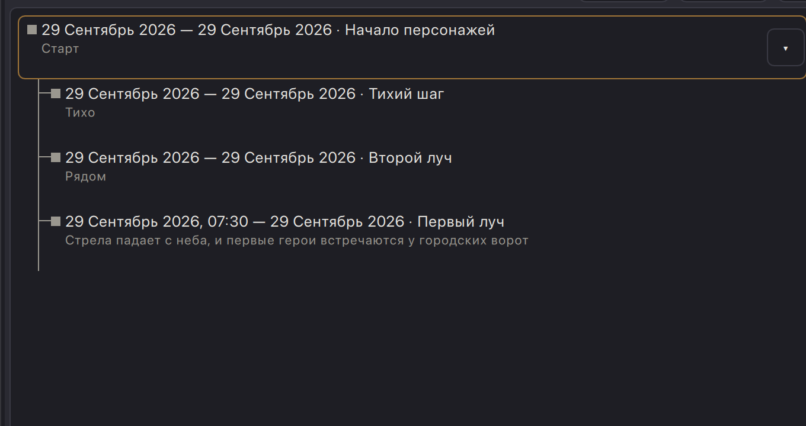
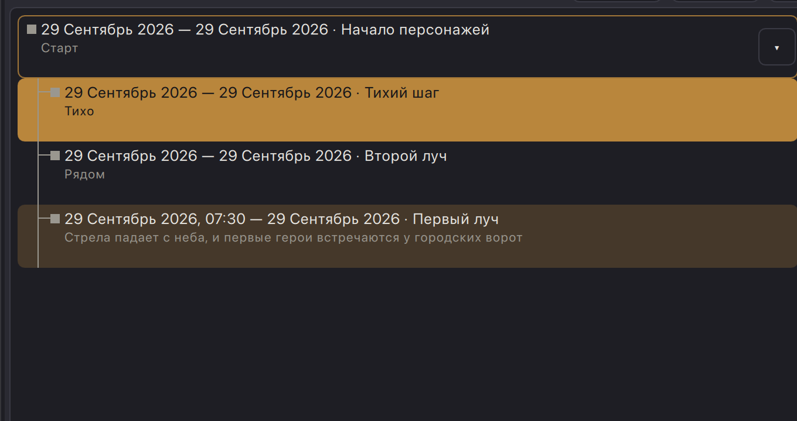

# Живой дизайн-аудит: дерево подсобытий на лестнице таймлайна (NRI-0023)

- Дата: 2026-09-29
- Точка проверки: строки дерева лестницы — линия-коннектор (P1), шеврон раскрытия (P2),
  залировка выделения/hover ребёнка (P3) + сбор смежных дефектов этих же строк.
- Вердикт: **inspected live** — интерфейс осмотрен на реальном Retina-рендере (2 px/pt),
  обе темы. Все три заявленные проблемы подтверждены; найдены смежные дефекты.
- Сборка/среда: рабочее дерево `master_workspace`, macOS, `python dev_run.py`
  (пакет «Master Workspace Dev»), throwaway-игра `qa-2026-09-29` (создана в этом прогоне,
  стандартный календарь). Затронутые компоненты: `app/presentation/qml/TimelineRowDelegate.qml`,
  `nri/components/ThemeIconButton.qml`, `nri/components/ThemeButton.qml`. **Код не менялся.**
- Данные: родитель «Начало персонажей» (описание «Старт» ⇒ двухстрочная строка),
  три подсобытия правым кликом → «Создать подсобытие»: «Первый луч» (время 07:30, описание —
  двухстрочная), «Тихий шаг» и «Второй луч» (короткие имена). Отклонение от плана:
  «Бессрочно» не удалось включить из автоматизации — см. наблюдение OBS-2 (у родителя
  конечная дата = дата начала, на дерево это не влияет).
- Методика: `get_app_state`/AXPress по element id; реальные мышиные события CGEventPost
  (паттерн OBS-1 из `docs/qa/2026-09-26-timeline-row-radius.md`) для одиночного клика-выделения
  и наведения; `screencapture -x` + попиксельный разбор Pillow. Темы переключались нативным
  меню «Настройки → Светлая тема» (обратно в тёмную — возвращено). AI-кнопки не нажимались.
  Приложение остановлено (`pkill -if "app.main"`).

Координаты в отчёте — экранные пункты (pt); снимки в доказательств — Retina 2 px/pt.

---

## P1. Линия дерева: ствол последнего ребёнка тянется за локоть

### Что видно

Развёрнутое дерево (три ребёнка под родителем):

Попиксельный профиль столбца ствола (чистый холст, тёмная тема) — ствол непрерывен от
267 pt до **428 pt**, локти детей на **278 / 332 / 386 pt**:

- ствол у **последнего** ребёнка («Первый луч», двухстрочная строка 374–428 pt) продолжается
  **на 42 pt ниже своего локтя** — почти на три четверти высоты строки (54 pt) — и обрывается
  на дне строки. Дерево выглядит незавершённым: линия «обещает» четвёртого ребёнка;
- у средних детей это корректно (ствол продолжается к следующему), у последнего — нет:
  ожидается угол «└», как в файловых деревьях;
- **стыки делегатов непрерывны**: столбец 32.0–32.5 pt не прерывается ни на одной границе
  строк (границы 267/320/374 пройдены попиксельно, разрывов/ступенек/горизонтального
  дрожания нет) — `ListView` без `spacing`, `height: row.height` делает своё дело;
- **ствол начинается ровно под родителем** (первый пиксель на 267 pt, граница
  родитель/ребёнок; у родителя-«сегодня» — сразу под его оранжевой обводкой) — дыры нет,
  но и до метки родителя линия не доезжает: внутри строки родителя ствола нет вовсе
  (деталь в «Смежных», A4);
- **высота локтя совпадает с центром метки ребёнка**: локоть 278–279 pt, метка 272–285 pt
  (центр 278.5) — якорь `anchors.verticalCenter: rowText.verticalCenter` у обоих, попадание
  точное;
- **двухстрочная строка**: локоть и метка сидят на строке заголовка (у верха строки), ствол
  идёт на всю высоту, включая строку описания, — у последнего ребёнка хвост свисает ещё и
  ниже текста описания (видно на снимке выше и на
  [hover-крупном](assets/2026-09-29-timeline-tree-design/2026-09-29-tree-hover-gutter-dark.png));
- в светлой тема картина идентична по геометрии, контраст линии к холсту выше:
  [ствол целиком, светлая](assets/2026-09-29-timeline-tree-design/2026-09-29-tree-trunk-full-light.png).

### Почему мешает

Линия вниз из последней строки — ложный сигнал «есть ещё дети»: первый читатель листает
дерево в ожидании несуществующего подсобытия; в плотном списке это единственный визуальный
указатель размера группы.

### Proposed look

Делегат уже знает порядок (`index`, `kind/depth/parent_id` приходят из модели). Достаточно
дополнительного скаляра `isLastSibling` (в `TimelineRowModel` — там же, где `hasChildren`),
и для последнего ребёнка рисовать ствол не `height: row.height`, а
`height: elbowY` — то есть обрывать на линии локтя (угол «└»); средние дети остаются с
полным стволом («├»). Линия под локтем у последнего не нужна вообще.

Доказательства:

- [expanded-clean-dark](assets/2026-09-29-timeline-tree-design/2026-09-29-tree-expanded-clean-dark.png) — чистое дерево, хвост 386→428 pt;- [trunk-seam-dark](assets/2026-09-29-timeline-tree-design/2026-09-29-tree-trunk-seam-dark.png) — стыки делегатов без разрывов;
- [trunk-top-dark](assets/2026-09-29-timeline-tree-design/2026-09-29-tree-trunk-top-dark.png) — начало ствола под родителем;
- [expanded-light](assets/2026-09-29-timeline-tree-design/2026-09-29-tree-expanded-light.png),
  [trunk-full-light](assets/2026-09-29-timeline-tree-design/2026-09-29-tree-trunk-full-light.png) — светлая тема.

---

## P2. Шеврон: читается как «квадратик с точкой», не как переключатель дерева

### Что видно

Кнопка — штатный `ThemeIconButton`: фиксированный квадрат 32×32 pt, радиус 6,
фон `color.bg.canvas`, рамка 1 px `color.border`; глиф — текстовый «▸/▾» кеглем
`font.size.md` (13 px). На реальных снимках:

| состояние | тёмная | светлая |
|---|---|---|
| свёрнутый, родитель не выбран | [chevron-collapsed-dark](assets/2026-09-29-timeline-tree-design/2026-09-29-tree-chevron-collapsed-dark.png) | (в светлой неселектнутый свёрнутый не отдельным кадром; светлый свёрнутый снят на выбранном родителе — см. следующий кадр, глиф ▸ идентичен) |
| развёрнутый, не выбран | [chevron-expanded-dark](assets/2026-09-29-timeline-tree-design/2026-09-29-tree-chevron-expanded-dark.png) | [chevron-expanded-light](assets/2026-09-29-timeline-tree-design/2026-09-29-tree-chevron-expanded-light.png) |
| **выбранный** родитель (заливка accent) | [on-selection-dark](assets/2026-09-29-timeline-tree-design/2026-09-29-tree-chevron-on-selection-dark.png) | [on-selection-light](assets/2026-09-29-timeline-tree-design/2026-09-29-tree-chevron-on-selection-light.png) |
| при наведении | [chevron-hover-dark](assets/2026-09-29-timeline-tree-design/2026-09-29-tree-chevron-hover-dark.png) (отличие от non-hover — на уровне антиалиасинга) | — |

Факты:

- **размер глифа**: треугольник ≈ 8×6 pt внутри квадрата 32×32 pt (замер по снимкам) —
  глиф занимает ~20 % стороны; на общем плане строки он читается как точка/песчинка, а не
  как направление («разверни меня» не считывается, см. общий план дерева у P1);
- **аффорданс**: обведённый рамкой квадрат сам по себе читается как кнопка, но в сочетании
  с точкой внутри выглядит скорее как иконка-маркер; в контексте строки (справа, в стороне
  от содержимого) его связь с деревом слева неочевидна — «что именно он раскрывает»
  непонятно;
- **на залировке выделения он не «сливается» — наоборот, прожигает дыру**: у выбранного
  родителя строка залита `color.accent` (α=1), а кнопка сохраняет canvas-фон и свою рамку:
  на оранжевой полосе тёмной темы — тёмный чип, на бронзовой полосе светлой — кремовый чип
  (см. on-selection выше). Глиф поверх чипа остаётся читаемым (fg на canvas), но выделение
  выглядит «продырявленным» square-чипом;
- **вертикаль не совпадает с текстом**: кнопка центрирована по всей высоте строки
  (`anchors.verticalCenter: parent.verticalCenter`), а контент-блок строки прижат к верху —
  у двухстрочного родителя чип сидит на ~11 pt ниже строки заголовка
  ([parent-selected-dark](assets/2026-09-29-timeline-tree-design/2026-09-29-tree-parent-selected-dark.png));
- **hover-фидбека практически нет**: `color.accent.hover` поверх canvas почти не отличим от
  canvas, рамка не меняется — снимок «под курсором» идентичен обычному.

### Почему мешает

Шеврон — единственный способ раскрыть дерево (двойной клик открывает карточку, одиночный
выбирает). Элемент, размер состояния которого («есть дети») и действие («развернуть») не
считываются с первого взгляда, делает фичу непроходимой для нового пользователя: три
подсобытия скрыты, а намёка на них — серая точка в углу.

### Proposed look

Два самодостаточных варианта (оба в рамках библиотеки):

1. **плоский глиф без кнопки-квадрата**: на строке — только ▸/▾ заметно крупнее
   (≈14–16 pt, token-кегль `font.size.lg`-семейства) в ранге `color.fg.muted`, с привязкой
   по вертикали к строке заголовка (тот же `rowText.verticalCenter`, что у метки и локтя);
   hover — подсветка самого глифа/лёгкий круг под ним, без постоянной рамки-квадрата;
   роль Button и accessibility-имя сохраняются (ThemeIconButton остаётся хит-тестом);
2. **ghost-кнопка**: прозрачный фон по умолчанию (без canvas-заливки и рамки), на hover —
   derivations-заливка, глиф крупный; на залировке выделения кнопка обязана менять гарнитур:
   фон → прозрачный/`accent.fg`-wash, глиф → `color.accent.fg`, чтобы не дырявить акцент.

В любом варианте — вертикальная привязка к заголовочной линии строки, а не к центру строки.

---

## P3. Заливка выделения/hover ребёнка занимает всю ширину, включая гуттер дерева

### Что видно

Реальный одиночный клик по ребёнку — выделение:

Крупный план левого края ([selection-gutter-dark](assets/2026-09-29-timeline-tree-design/2026-09-29-tree-selection-gutter-dark.png),
[selection-gutter-light](assets/2026-09-29-timeline-tree-design/2026-09-29-tree-selection-gutter-light.png)):

- **левый край залировки — у левого inset списка**, ровно как у строки основного события:
  `rowWash` = `anchors.fill: parent`, и гуттер с локтем/стволом (локти детей на x≈32 pt)
  попадает внутрь полосы. Отступ-рихтовка дерева (20 pt) заливкой стирается: выбранная
  строка ребёнка по форме неотличима от выбранного родителя — принадлежность строки
  «прячется» под полосой;
- **линия не затирается**: коннекторы и метка рисуются после залировки и остаются поверх
  (пиксельно ствол виден сквозь выделение: тёмная — серый по оранжевому, светлая — тёмный
  по бронзовому), но поверх сплошного accent они теряют ранг: метка типа ребёнка
  (muted-серый фолбэк) на оранжевой полосе выглядит грязным пятном, а текст заголовка при
  этом переключается на `accent.fg` — иерархия «текст первый, дерево служебное» ломается;
- **границы соседних строк**: выделение + соседний hover
  ([selected-plus-hover-dark](assets/2026-09-29-timeline-tree-design/2026-09-29-tree-selected-plus-hover-dark.png)) —
  полосы разведены только 1-pt щелью холста и разницей α; на скруглённых углах (radius.sm)
  полосы визуально «слипаются» в одну цветную массу — без разрыва в гуттере соседство детей
  читается плохо. (Одновременно выделена одна строка, так что одноцветного соседства двух
  child-выделений не бывает; но выделение+hover — штатная пара, и она уже сливается.)
- **hover-залировка ребёнка** — та же геометрия на всю ширину
  ([hover-gutter-dark](assets/2026-09-29-timeline-tree-design/2026-09-29-tree-hover-gutter-dark.png));
- **обводка «сегодня»** (родитель-«сегодня»): пока родитель не выбран — оранжевая рамка
  ([parent-collapsed-dark](assets/2026-09-29-timeline-tree-design/2026-09-29-tree-parent-collapsed-dark.png));
  при выделении — см. смежный дефект A2: рамка исчезает (оранжевый по оранжевому).

### Почему мешает

Заливка — самый заметный сигнал состояния строки; занимая гуттер, она «экспроприирует»
дерево: выбранное подсобытие визуально перестаёт быть ребёнком (полоса того же размера,
что у родителя), а связь линией начинает выглядеть нарисованной «поверх чужой» строки.
Соседние строки сливаются в блок одного цвета.

### Proposed look (зафиксированный заказчиком — подтверждён наблюдениям)

Залировка (и hover, и выделение) **дочерней строки должна начинаться после отступа дерева** —
слева от `textLeftPad + contentShift` (или прямо от локтя ребёнка), а не от `x: 0`:

- для `depth > 0`: `rowWash`/hover-wash с левым краем на уровне локтя (или на 4–6 pt левее
  метки), скругление только там, где полоса начинается; локоть и ствол остаются «в холсте»
  и не покрываются заливкой;
- строка родителя сохраняет полосу на всю ширину — тогда ширина полосы сама становится
  признаком уровня (родитель — широкая, ребёнок — «висящая на локте»);
- заодно: поверх выделения коннектор/метку стоит перекрашивать в то же семейство, что и
  текст (`accent.fg` / `color.fg.muted` на wash-ранг), чтобы вторичный слой не грязнил
  акцент (см. A5).

---

## Смежные дефекты этих же строк

| # | severity | что | доказательство |
|---|---|---|---|
| A1 | minor | **Шеврон разъезжается с текстом**: центрирован по высоте всей строки; у двухстрочного родителя сидит на ~11 pt ниже заголовка. Линия, метка и заголовок живут «верхним» якорем, кнопка — «центральным». | [parent-selected-dark](assets/2026-09-29-timeline-tree-design/2026-09-29-tree-parent-selected-dark.png), [chevron-on-selection-dark](assets/2026-09-29-timeline-tree-design/2026-09-29-tree-chevron-on-selection-dark.png) |
| A2 | major | **Обводка «сегодня» невидна на выбранной строке**: `rowNowOutline` рисует `color.accent.hover` поверх сплошного accent-выделения — оранжевый по оранжевому, маркер «начинается сегодня» теряется ровно в тот момент, когда пользователь смотрит на событие. | сравнить [parent-collapsed-dark](assets/2026-09-29-timeline-tree-design/2026-09-29-tree-parent-collapsed-dark.png) (рамка видна) и [parent-selected-dark](assets/2026-09-29-timeline-tree-design/2026-09-29-tree-parent-selected-dark.png) (рамка пропала) |
| A3 | minor | **Hover шеврона не даёт видимого отклика** (фон/рамка почти не меняются) — см. P2-таблицу; у icon-кнопок в списке это единственный канал «я интерактивная». | [chevron-hover-dark](assets/2026-09-29-timeline-tree-design/2026-09-29-tree-chevron-hover-dark.png) |
| A4 | suggestion | **Ствол не дотянут до метки родителя**: внутри строки родителя коннектора нет, линия начинается с границы строк; под родителем с обводкой «сегодня»/описанием между меткой родителя и началом ветки — ~40 pt пустоты. Спецификационная «связность со строкой родителя» держится только на отсутствии отступа между строками. | [trunk-top-dark](assets/2026-09-29-timeline-tree-design/2026-09-29-tree-trunk-top-dark.png) |
| A5 | minor | **Метка типа и коннектор не переключают ранг на выделении**: текст заголовкаflip-ится в `accent.fg`, а метка/ствол остаются muted-серыми поверх сплошного accent — серый по оранжевому (тёмная) мутнеет, ребёнок без типа выглядит «пятном» | [selection-gutter-dark](assets/2026-09-29-timeline-tree-design/2026-09-29-tree-selection-gutter-dark.png), [child-selected-dark](assets/2026-09-29-timeline-tree-design/2026-09-29-tree-child-selected-dark.png) |
| A6 | suggestion | **Стык скругления полосы с холстом**: у выбранной строки radius.sm срежет угол в гуттере, где рядом проходит ствол — на 2-строчных детях это даёт лишний «зазубренный» пиксельный ритм у начала локтя; при proposed-решении P3 проблема уходит сама | [selection-child-edge-dark](assets/2026-09-29-timeline-tree-design/2026-09-29-tree-selected-child-edge-dark.png) |

## Наблюдения вне строк дерева (не дефекты проверяемой области; для регистрации)

- **OBS-2 (a11y/состояние).** `AXPress` по чекбоксу (`ThemeCheckBox`) переключает
  визуальное/`AXValue` состояние, но `onToggled` не срабатывает → `EventDialog` «Бессрочно»
  и «Светлая тема» в лаунчере из автоматизации «включаются», никуда не приводя (значение в
  `~/.nri_manager/ui.json` не менялось; настоящий клик мышью и клик по нативному меню
  работают). Подтверждено дважды в этом прогоне. Похоже, обработчики висят на `toggled`
  (пользовательский жест), а accessibility-пресс пишет `checked` программно. Стоит пинать
  тем же `doAction("Press")`-тестом, что и остальные действия.
- **OBS-1 (подтверждён, уже известна).** Фоновые координатные клики computer-use не доходят
  до QML-островов главного окна; выделяющий клик и hover доставлялись CGEventPost-событиями
  сессии (hover дополнительно требовал warp+post, чтобы AppKit сгенерировал вход в окно).
  Правый клик по element id (QMenu) и все AXPress работают. Случайный клик одного прогона
  попал в окно Sublime Text, оказавшееся поверх (никаких изменений файлов не было) —
  перед синтетическими кликами в регионе окно приложения нужно поднимать.

## Итог

- **P1 подтверждён** (major): ствол последнего ребёнка висит на 42 pt ниже локтя; стыки
  непрерывны, локоть↔метка совмещены точно; лечение — угол «└» у последнего (`isLastSibling`).
- **P2 подтверждён** (major): 8×6-pt глиф в 32-pt рамке читается точкой; на выделении —
  дыра-чип вместо harmony; hover-отклика нет; вертикаль гуляет от текста.
- **P3 подтверждён** (major): залировка ребёнка на всю ширину стирает отступ дерева;
  proposed look (старт залировки от локтя/отступа) адекватен наблюдению; линии остаются
  видимыми поверх, но теряют ранг (A5).
- Смежные: A1–A6 (см. таблицу); вне скоупа — OBS-2.
